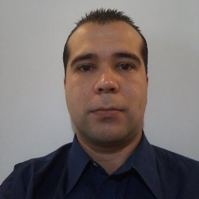

# CURRICULUM VITAE:  
--------------------------
## DATOS PERSONALES:

**APELLIDO:** Luques

**NOMBRES:** Bruno Daniel

**DNI:** 32.173.030

**CUIL:** 20-32173030-3	

**FECHA DE NACIMIENTO:** 06/02/1986

**DOMICILIO:** 9 de Julio 433, Morón, Bs. As.

**CELULAR:** (011) 1164282254

**E-MAIL:** bruno_luques@hotmail.com

### FORMACIÓN ACADÉMICA:

**EDUCACIÓN PRIMARIA:** Escuela N° 9 Genaro Berón de Astrada.

**EDUCACIÓN SECUNDARIA:** Instituto Dr. Mariano Moreno. (Bachiller con orientación en economía).  

**EDUCACIÓN UNIVERSITARIA:** Universidad Nacional De Hurlingham. (Cursando la tecnicatura en informática).

### CONOCIMIENTOS:

+ COMERCIO: Atención personalizada al público, control de stock, inventarios,   control de vencimientos, control de calidad, trato con proveedores, reposición de mercadería, marketing y técnicas de venta.-

+ METALÚRGICA: Manejo de maquinarias industriales, trabajos de herrería, soldadura, cañería y electricidad.-

+ ADMINISTRACIÓN: Asientos de comprobantes, descargos ante organizaciones públicas, habilitaciones y transferencias comerciales
 
+ RECURSOS HUMANOS: Altas y bajas del personal, administración de los recursos, liquidación y pagos de sueldos, coaching de trabajo en equipo, incentivación para lograr objetivos, análisis FODA, evaluación de desempeño, control de asistencia, licencias y novedades mensuales.- 

+ TESORERÍA: Pagos a proveedores, manejo de grandes cantidades de efectivo, emisión y registro de cheques y otros medios de pago, aperturas de cuentas bancarias, manejo de plataformas web bancarias, arqueos de caja.- 

+ CONTABILIDAD: Asignación de cuentas contables, conciliaciones de cuenta corriente, altas / bajas y modificaciones de condición fiscal, autorizaciones de impresión de comprobantes, facturación electrónica, altas / bajas y liquidación de ingresos brutos (Arba), iva y convenio multilateral, redacción y sellados de contratos, administración de puntos de venta e  impresoras fiscales.-

+ INFORMÁTICA: Manejo avanzado de Microsoft Word, Manejo avanzado de Microsoft Excel, Manejo avanzado de Windows, administración de redes LAN, Manejo avanzado de exploradores de internet, buen manejo de herramientas de seguridad informática y sesiones remotas, Siap, aplicativos de Afip, Gobstones, Wollok, Git Hub, Ruby, Java.  
Actualmente cursando la tecnicatura en informática.

### CURSOS Y TALLERES:

+ Administración de redes - Loopian (2015)

+ Introducción a la seguridad informática - Educación IT (2017)

+ Excel avanzado - Capacitarte UBA (2015)

+ Excel avanzado - Capacitarte UBA (2018)

+ Liquidación de sueldos - Capacitarte UBA (2017)

+ Mandatario del automotor - Aproa (2016)

+ Taller teórico - práctico de gestoría náutica - Haciendo Conexiones (2017)

+ Taller de Community Manager - Haciendo Conexiones (2018)

+ Taller de grabado de cristales automotor - Haciendo Conexiones (2018)

+ Programador web full-stack junior - Argentina Programa (2022)

### EXPERIENCIAS LABORALES:

+ MAXIKIOSCO FAMILY:  
**PERIODO TRABAJADO:** 06/04/1994 – 03/08/1998  
**TAREAS DESEMPEÑADAS:** 
Atención personalizada al público, manejo de stock, control de calidad, trato con proveedores, reposición de mercadería.  
**DOMICILIO:** Medrano 341, Cap. Fed.  
**TELÉFONO: 4958-6559**  

+ **HELADERÍA GSTAAD:**  
**PERIODO TRABAJADO:** 04/10/1998 – 12/11/1999  
**TAREAS DESEMPEÑADAS:** 
Atención personalizada al público, entrega a domicilio, tareas varias.  
**DOMICILIO:** Medrano 350, Cap. Fed.

+ **SHOP EXPRESS:**  
**PERIODO TRABAJADO:** 01/03/2004 – 08/03/2005  
**TAREAS DESEMPEÑADAS:** Atención personalizada al público, manejo de stock, control de calidad, trato con proveedores, reposición de mercadería.    
**DOMICILIO:** Pte. Perón 2463 Valentín Alsina, Lanús, Bs As.  
**TELÉFONO:** (02220) 477490 (Daniel Volente)  

+ **NEW FUEL S.A. :**  
**PERIODO TRABAJADO:** 01/04/2005 – 20/12/2006  
**TAREAS DESEMPEÑADAS:** Manejo de maquinarias industriales, trabajos de herrería, cañería, sector de compras, construcción de máquinas de bio-combustible.  
**DOMICILIO:** Crovara 4031, La tablada, Bs. As.  
**TELÉFONO:** 4699-6641  

+ **ROKLA:**   
**PERIODO TRABAJADO:** 18/03/2007 - 16/04/2007  
**TAREAS DESEMPEÑADAS:** Conductor de transporte de pasajeros (taxi).  
**DOMICILIO:** Pringles 1042 cap. Fed.  
**TELÉFONO:** 4867-4441

+ **RUBÉN MONTESANO:**  
**PERIODO TRABAJADO:** 18/04/2007 - 29/05/2007  
**TAREAS DESEMPEÑADAS:** conductor de transporte de pasajeros (taxi).  
**DOMICILIO:** V. de Lujan y Arias, Lanús, Bs. As.  
**TELÉFONO:** 4241-5839

+ **OPEN 25 DRUGSTORES:**  
**PERIODO TRABAJADO:** 01/10/2007 - 30/04/2008  
**TAREAS DESEMPEÑADAS:** Encargado de Maxikiosco  
**DOMICILIO:** Maipú 504, Cap. Fed.  
**TELÉFONO:** (011) 4371-5773 

+ **SUPERMERCADO CHANGO S.R.L.:**  
**PERIODO TRABAJADO:** 15/10/2009 – 30/09/2014  
**TAREAS DESEMPEÑADAS:** Apoderado, Auditoria, RRHH, encargado de administración, asistente contable, gestiones legales y comerciales.  
**DOMICILIO:** Rivadavia 250, Tinogasta, Catamarca.  
**TELÉFONO:** (03837) 420250 Cr. David Longo  

+ **ESTUDIO CINATRA:**  
**PERIODO TRABAJADO:** 01/07/2015 - Actualidad  
**TAREAS DESEMPEÑADAS:** altas, bajas y modificaciones de condición fiscal, facturación electrónica, altas / bajas y liquidación de ingresos brutos, iva y convenio multilateral, redacción y sellados de contratos, administración de puntos de venta e  impresoras fiscales, habilitaciones comerciales y asesoría informática.  
**DOMICILIO:** 9 de Julio 433, Morón, Bs. As.  
**TELÉFONO:** (011) 15-3363-1990 (Cra. Cinatra)
